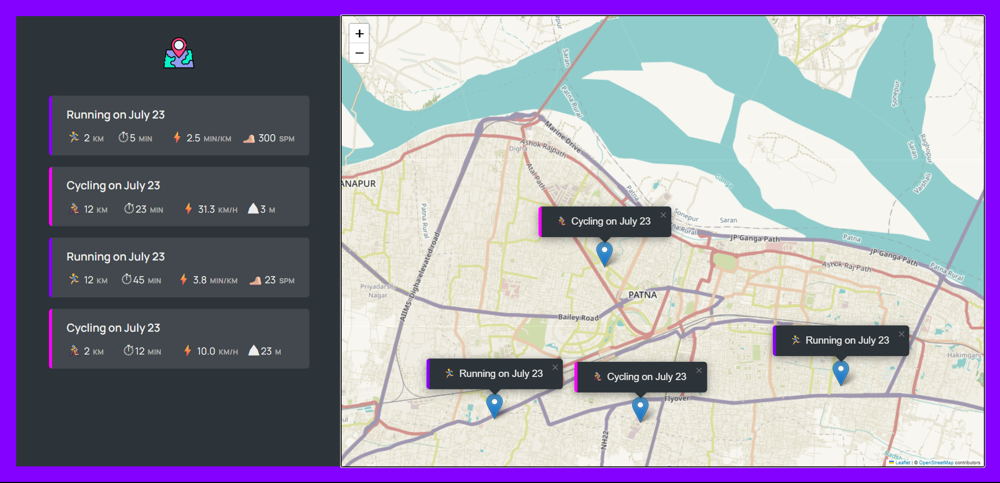

# GeoFit
# 🗺️ GeoFit - Workout Tracker with Map

GeoFit is a web application that allows users to track their **running and cycling workouts** on an interactive map. Built using **JavaScript**, **Leaflet.js**, and the **Geolocation API**, it offers a clean and intuitive interface for logging and visualizing workouts with map markers.

## 🚀 Features

- 🌍 Detects and centers the map on your current location using the Geolocation API
- 📍 Click on the map to add a workout log
- 🏃‍♂️ Choose between running or cycling
- 📏 Log distance, duration, pace (for running), and speed (for cycling)
- 🗺️ Workout markers on the map with popup descriptions
- 💾 Automatically saves data in your browser using LocalStorage
- 🧠 Built using Object-Oriented Programming (OOP) principles

## 🔧 Technologies Used

- HTML5
- CSS3
- JavaScript (ES6+)
- Leaflet.js (map functionality)
- Geolocation API
- LocalStorage

## 📸 Screenshots

# GeoFit
# 🗺️ GeoFit - Workout Tracker with Map

GeoFit is a web application that allows users to track their **running and cycling workouts** on an interactive map. Built using **JavaScript**, **Leaflet.js**, and the **Geolocation API**, it offers a clean and intuitive interface for logging and visualizing workouts with map markers.

## 🚀 Features

- 🌍 Detects and centers the map on your current location using the Geolocation API
- 📍 Click on the map to add a workout log
- 🏃‍♂️ Choose between running or cycling
- 📏 Log distance, duration, pace (for running), and speed (for cycling)
- 🗺️ Workout markers on the map with popup descriptions
- 💾 Automatically saves data in your browser using LocalStorage
- 🧠 Built using Object-Oriented Programming (OOP) principles

## 🔧 Technologies Used

- HTML5
- CSS3
- JavaScript (ES6+)
- Leaflet.js (map functionality)
- Geolocation API
- LocalStorage

## 📸 Screenshots

## 📸 App Preview

